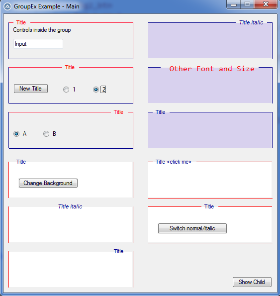
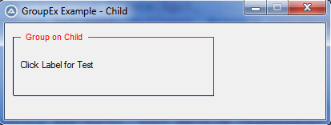

### About
<span>The ```GroupEx.au3``` can be used to create a custom group control. It consists of a set of labels. This allows an individual design of title, background and border or border parts.</span>
### Current
<span>v 0.14</span>

### Functions
<span><table style='font-family:"Courier New"'>
<tr><td>_GuiCtrlGroup_Create</td>
<td>Creates a group control as collection of labels.<br />Returns a structure with IDs and settings of all group elements.</td></tr>
<tr><td>_GuiCtrlGroup_Close</td>
<td>Starts a new group and so the previous group will closed.<br />Only required, if outside the group radio buttons following. But it can used to close each group.</td></tr>
<tr><td>_GuiCtrlGroup_Set</td>
<td>Changes values of a _GuiCtrlGroup_Create() created control.<br />What to do is determined by the action flag passed.<br />For moving, an array of controls can be passed that will be moved along with it.</td></tr>
<tr><td>_GuiCtrlGroup_SetState</td>
<td>Changes the state of a _GuiCtrlGroup_Create() created control. ($GUI_SHOW, $GUI_HIDE, $GUI_ENABLE, $GUI_DISABLE)<br />An array of controls in the group can be passed, and their status will be set as well.</td></tr>
</table></span>
<span>See the ```GroupsEx_Example.au3``` file for how it is applied.</span>

### Flags
<span><table style='font-family:"Courier New"'>
<tr><td><b>BORDER COLOR SETTINGS</b></td><td></td></tr>
<tr><td>$_GROUPBORDER_LEFT</td><td>Left border</td></tr>
<tr><td>$_GROUPBORDER_TOPL</td><td>Top border left from title</td></tr>
<tr><td>$_GROUPBORDER_TOPR</td><td>Top border right from title</td></tr>
<tr><td>$_GROUPBORDER_TOP</td><td>Top border (_TOPL &amp; _TOPR)</td></tr>
<tr><td>$_GROUPBORDER_RIGHT</td><td>Right border</td></tr>
<tr><td>$_GROUPBORDER_BOTTOM</td><td>Bottom border</td></tr>
<tr><td>$_GROUPBORDER_ALL</td><td>Full border (all border parts)</td></tr>
<tr><td><b>TEXT SETTINGS</b></td><td></td></tr>
<tr><td>$_GROUPTEXT_FORE</td><td>Sets text fore color.</td></tr>
<tr><td>$_GROUPTEXT_BACK</td><td>Sets text BG-color, should be $GUI_BKCOLOR_TRANSPARENT (default), if Group BG-color is diffent to GUI BG-color or same as Group BG-color.</td></tr>
<tr><td>$_GROUPTEXT_TRANS</td><td>Sets text BG-color to $GUI_BKCOLOR_TRANSPARENT</td></tr>
<tr><td>$_GROUPTEXT_TEXT</td><td>Sets the title text</td></tr>
<tr><td>$_GROUPTEXT_ITALIC</td><td>Sets text style to italic</td></tr>
<tr><td>$_GROUPTEXT_DEFAULT</td><td>Sets text style back to normal</td></tr>
<tr><td>$_GROUPTEXT_LEFT</td><td>Sets text position to left side (default)</td></tr>
<tr><td>$_GROUPTEXT_CENTER</td><td>Sets text position centered</td></tr>
<tr><td>$_GROUPTEXT_RIGHT</td><td>Sets text position to right side</td></tr>
<tr><td><b>BACKGROUND COLOR GROUP</b></td><td></td></tr>
<tr><td>$_GROUPBACKGROUND</td><td>Sets BG-color inside border area</td></tr>
<tr><td><b>MOVE / SIZE THE GROUP</b></td><td></td></tr>
<tr><td>$_GROUP_MOVE_ABS</td><td>Give param as array [x,y,width,height], values that should not change set to "\*". You can also give values as comma seperated string: "x,y,width,height".<br />y,width,height by default has value "\*", so you can omit them if not need to change. (values absolute in the child window)</td></tr>
<tr><td>$_GROUP_MOVE_REL</td><td>Same as before, but given values relative to current position/size</td></tr>
</table></span>

### Gallery
<br />
