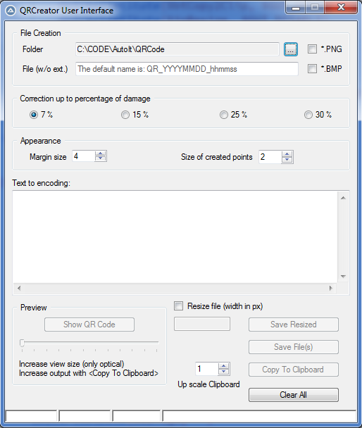
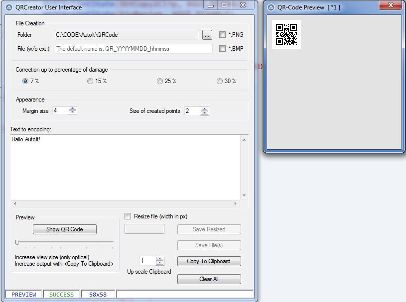
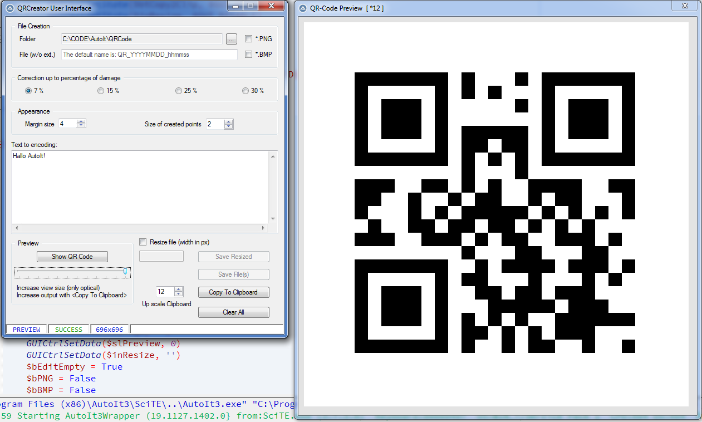
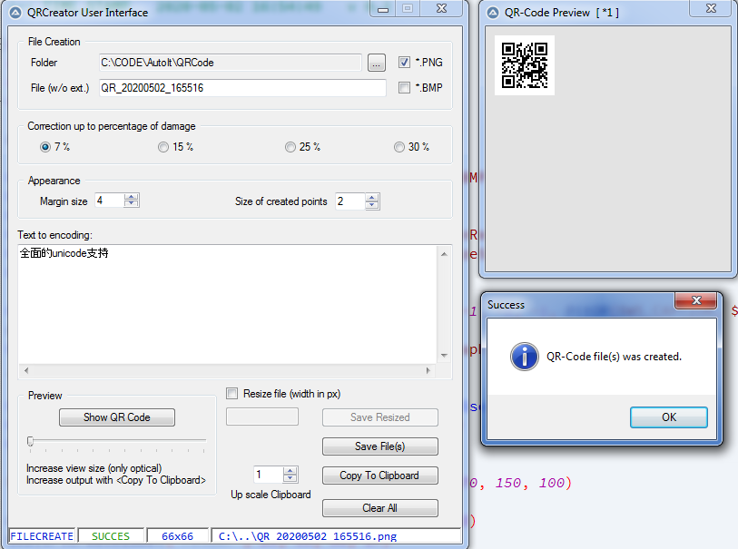
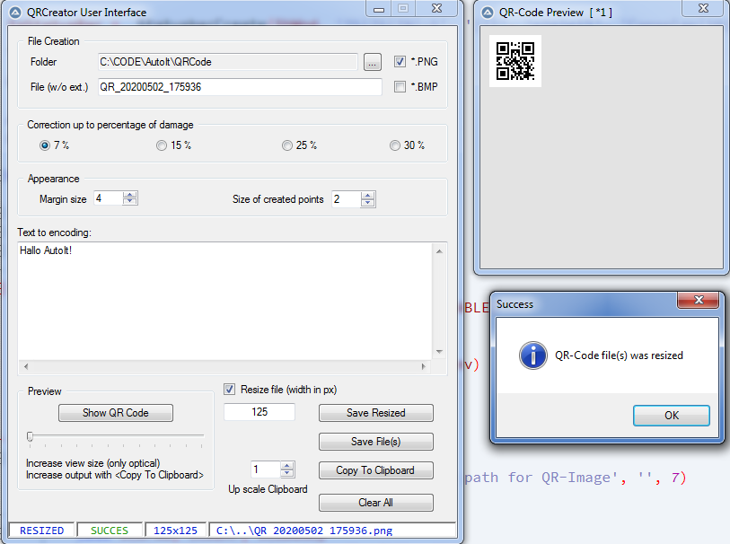

### About
With this UDF you can add the creation of QR codes to your projects with a graphical user interface or via the command line. 
It uses the [quricol - QRCode generator library by Serhiy Perevoznyk](https://github.com/perevoznyk/quricol). Therefore, please observe the [licence conditions](https://github.com/perevoznyk/quricol/blob/master/LICENSE) when using it in your projects. 

### Current
 QRCreator.au3&nbsp;&nbsp;&nbsp;&nbsp;v 0.3 
QRCreatorUI.au3&nbsp;&nbsp;v 0.3 
QRCreatorCI.au3&nbsp;&nbsp;v 0.2

### Components

<table style='font-family:"Courier New"'>
<tr><td>QRCreator.au3</td><td>This is the base UDF that need for all. You can write your own applications by using it.</td></tr>
<tr><td>QRCreatorUI.au3</td><td>This is the graphical User Interface to deal with all functions of the UDF. As a special feature, you have a preview that can be enlarged.</td></tr>
<tr><td>QRCreatorCI.au3</td><td>This is the Commandline Interface. With the exception of HBITMAP generation, which is not required on the command line, you can perform all functions of the UDF to generate QR codes.</td></tr>
</table>

### QRCreator.au3 - functions
<table style='font-family:"Courier New"'>
<tr><td>_QR_generatePNG</td><td>Generates the QR-Code as PNG file for the passed text.</td></tr>
<tr><td>_QR_generateBMP</td><td>Generates the QR-Code as BMP file for the passed text.</td></tr>
<tr><td>_QR_getHBitmap</td><td>Creates a HBITMAP handle for the QR-Code for the passed text. 
       Don't forget to delete it, if no more need (_WinAPI_DeleteObject(HBITMAP)).</td></tr>
<tr><td>_QR_copyToClipboard</td><td>Copies the QR-Code picture for the passed text to the clipboard.</td></tr>
<tr><td>_QR_FileDefault</td><td>Generates a default filename (QR_YYYYMMDD_hhmmss)</td></tr>
<tr><td>_QR_getLastCall</td><td>Asks for the result of the last call  (_QR_getHBitmap/_QR_copyToClipboard/_QR_generateBMP/_QR_generatePNG) Gets a structure with: .success(1/0) .error(@error) .width .type(B/C/[F/R]) .output(hBMP/''/fullpath) .margin .sizept .corrlevel Types(.type): B (HBITMAP), C (Clipboard), F (File created), R (resized file created)</td></tr>
</table>

#### Used parameters

<table style='font-family:"Courier New"'>
<tr><td>$_sText</td><td>The text to encode. Full unicode is supported.</td></tr>
<tr><td>$_sPathOut</td><td>ONLY: _QR_generatePNG und _QR_generateBMP The full path of the file to create. If only a filename has passed the @ScriptDir will used. Without a filename the default filename will used (QR_YYYYMMDD_hhmmss). If the filename exists, it will get a suffix (1..n) until it's unique.</td></tr>
<tr><td>$_iMargin</td><td>The QR-Code margin in pixel.</td></tr>
<tr><td>$_iSizePt</td><td>Size of the points in the QR-Code (1-4, depends by the correction level) If a wrong value is passed, it will corrected by the script.</td></tr>
<tr><td>$_iCorrLvl</td><td>The used correction level (0-3). Allows to read a QR-Code if some parts damaged.</td></tr>
<tr><td>$_iOutSize</td><td>ONLY: _QR_generatePNG und _QR_generateBMP As a new feature you can pass a target size for created file. The size of the file depends by used correction level and the size of created points. If you pass a value for width (and so for heigth too), the default by the dll created file will resized for this size. If the passed size is to small it raises an error.</td></tr>
<tr><td>$_iScale</td><td>ONLY: _QR_copyToClipboard Also new is the ability to scale up the QR-Code copied to clipboard. It's a factor for linear scaling, based on the default creation size by the dll call.</td></tr>
</table>

### QRCreatorUI.au3

All information for the actions you've done will shown in the statusbar of the GUI.  
But this is my own created statusbar, that allows formatting. I've attached them too.

### QRCreatorCI.au3

#### Available command line parameters

##### REQUIRED
<table style='font-family:"Courier New"'>
<tr><td>text</td><td>Text for encoding</td></tr>
</table>

##### OPTIONAL
<table style='font-family:"Courier New"'>
<tr><td>file</td><td>path/filename[.ext] If ommited, the default will used: @HomeDrive & @HomePath & "\QR_YYYYMMDD_hhmmss"</td></tr>
<tr><td>type</td><td>png,bmp,clip (or combined png/bmp) If ommited, 'png' will used. With clip runs CopyToClipboard. If file has .ext and type is passed but is different to .ext than will used type.</td></tr>
<tr><td>width</td><td>ONLY: File creation Size in pixel, (also used for height) Initializes a resizing of the default created QR-Code. Resizing fails, if passed size is smaller as the default generated file.</td></tr>
<tr><td>scale</td><td>ONLY: CopyToClipboard Factor for up scaling the QR-Code</td></tr>
<tr><td>margin</td><td>The margin around the QR-Code in pixel (Default = 4)</td></tr>
<tr><td>corrlevel</td><td>Up to 7%, 15%, 25% or 30% damage [0, 1, 2, 3]. (Default = 0)</td></tr>
<tr><td>sizept</td><td>The size of the painted pixel itself. The value depends on the correction level. Only the smallest point size can be used for the largest correction level. The value will corrected automatically, if wrong.</td></tr>
</table>

#### Return values

comma separated string with:

	ERROR=@error
	RESULT='FullFilePath' or 'CLIPBOARD'
	SIZE=width x heigth
	SIZEPT=The really used (may be corrected) size of point
    MARGIN=The used margin size
    CORRLEVEL=The used correction level

### Gallery

#### CI

  

 

 

 

 

 

#### UI

 

 

 

 

 

 

 

 
