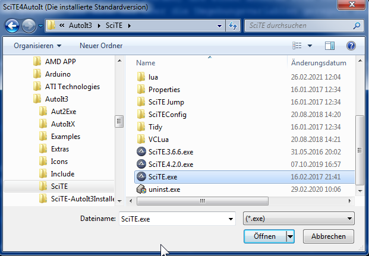
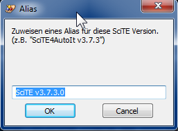
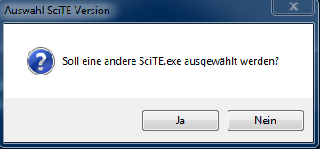
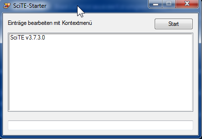
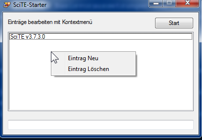
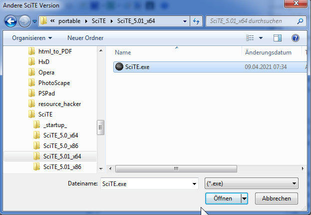
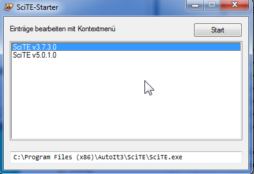

### About
SciTE_Starter ist ein Tool um unterschiedliche Versionen des SciTE-Editors mit jeweils eigener `SciTEUser.properties` starten zu können.
Hintergrund:
SciTE kann nicht mit Parametern aufgerufen werden, die einen anderen Pfad für die SciTEUser.properties angeben. Das kann nur über die Umgebungsvariablen geregelt werden und das übernimmt der SciTE_Starter. Das Ändern der Umgebungsvariablen geschieht nur temporär, sodass nach Beenden von SciTE der Standardpfad für die SciTEUser.properties wieder gültig ist.

Dieses Tool ist für alle gedacht, die SciTE nicht nur für AutoIt nutzen, bzw. auch eigene Erweiterungen mit Lua erstellen und diese in verschiedenen SciTE-Versionen testen möchten.
Nur SciTE4AutoIt bietet von Haus aus umfangreiche Zusatztools für AutoIt. Nicht für jede neue SciTE-Version wird eine neue Version SciTE4AutoIt erstellt. Das ist auch nicht zwingend erforderlich, da viele Neuerungen ausschließlich Nicht-AutoIt Themen betreffen.

### Usage

Es muss eine mit dem Installer eingerichtete Version von `SciTE4AutoIt` vorhanden sein.
Andere SciTE-Versionen sind als `*.zip` zu laden ([SciTEDownload](https://www.scintilla.org/SciTEDownload.html)) und in einen Ordner mit User-Schreibrechten zu entpacken. z.B.

	C:\PortableSciTE\SciTE_5.01_x64
	                \SciTE_5.20_x64

In diesem Hauptpfad befindet sich dann die zur Version gehörende `SciTEUser.properties`.

SciTE erfordert eine `SciTEStartup.lua`, um die Basisvoraussetzungen zum Start zu definieren. Da sich diese meist für alle Versionen gleichen, können wir hier einen für alle Versionen gültigen Ordner anlegen:

	C:\PortableSciTE\_startup_

Der erste Eintrag in der jeweiligen `SciTEUser.properties` muss dann auf die Startup Datei verweisen:
```cpp
# Pfad zum STARTUP SKRIPT
ext.lua.startup.script=C:/PortableSciTE/_startup_/SciTEStartup.lua
```

Neben der SciTEStartup.lua werden hier die Lua-Skripte für z.B. Event-Registrierung gespeichert.<br />
Es kann selbstverständlich auch für jede Version eine eigene Startup-Datei angelegt werden, z.B. im Hauptordner der Version.<br />
Die `SciTE_Starter.au3` ist zu kompilieren und abzuspeichern - sinnvoll wäre sicher der Pfad `C:\PortableSciTE`.<br />
Beim ersten Aufruf der `SciTEStarter` wird eine INI-Datei mit Pfaden zur installierten Standardversion und zu weiteren SciTE-Versionen im Dialog erstellt.<br />
<br />
Für die Version kann ein Alias vergeben werden:<br />
<br />
Es könnten sofort andere Versionen mit erfasst werden. (Wurde hier verneint)<br />
<br />
Die Startoberfläche mit dem ersten Eintrag wird angezeigt.<br />
<br />
Weitere Einträge können hinzugefügt/entfernt werden mit dem Kontext-Menü.<br />
<br />
Für `Eintrag Neu` erscheint dann ein erneuter Auswahl- und Alias-Dialog.<br />
<br />
Um eine Version zu starten, wird diese in der Liste markiert (der Startpfad wird unterhalb der Liste angezeigt) und mit Klick auf den Start-Button ausgeführt.<br />
<br />

Die erstellte INI-Datei sollte `nicht per Hand` bearbeitet werden, sondern ausschließlich über das integrierte Kontext-Menü. Ein Verschieben des Eintrages für die Standardinstallation (muss zwingend der erste Eintrag sein) wird so vermieden.

Das Handle der vom SciTEStarter aufgerufenen Version wird in der Datei
```go
%TEMP%\SC_starter.hwnd
```
gespeichert und kann z.B. in AutoIt so verwendet werden:
```ruby
$hSciTE = HWnd( FileRead(@TempDir & '\SC_starter.hwnd') )
```
